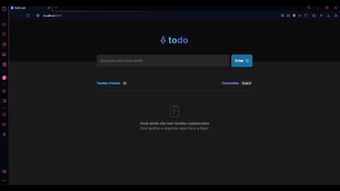

# ToDo List with React/Typescript



Welcome to the ToDo List. In this project, you can find a to-do list built on React and Typescript technologies. So, you will have access to create, edit and delete tasks with their respective feedbacks.

## Technologies used

[](https://www.typescriptlang.org/)
[](https://reactjs.org/)
[](https://vitejs.dev/)

## How to run

First, clone the repository:

```bash
git clone https://github.com/pedrohenriquee8/todo-list.git
```

Then, install the dependencies:

```bash
npm install
```

Finally, run the project and start the json-server:

```bash
npm run dev
npx json-server database.json
```

## Credits

This project was based on the challenge proposed by [Rocketseat](https://www.github.com/rocketseat).

## Final Considerations

It was extremely important to develop this project, considering that it was essential to apply current knowledge in the technologies used. If you want to contribute to this project, feel free to submit a pull request with your suggestions!
